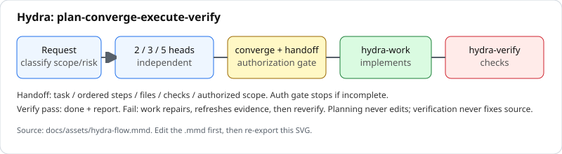
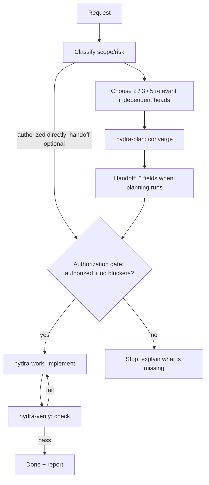
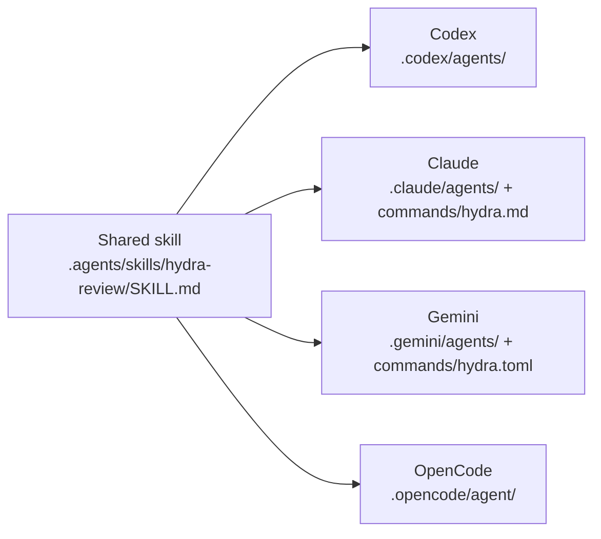

# Hydra for agent CLIs

Hydra helps an agent review or change a project with several independent perspectives. It asks focused planning heads to inspect the same request, compares their evidence and tradeoffs, carries out the authorized work, then verifies the result. It works with Codex, Claude Code, Gemini CLI, and OpenCode.

> **At a glance:** Classify scope/risk → authorize → `hydra-work` implements → `hydra-verify` checks. Tier 0 bypasses planning entirely: authorized low-risk fixes go directly to work with proportional verification. Otherwise 2 / 3 / 5 relevant independent heads converge to a 5-field handoff first, but an authorized request can enter work directly with a brief scope. Planning never edits; verification never fixes source.



## Contents

- [How Hydra works](#how-hydra-works-in-your-project)
- [Architecture](#architecture)
- [Quick start from GitHub](#quick-start-from-github)
- [Start Hydra in your project](#start-hydra-in-your-project)
- [Update or resolve a conflict](#update-or-resolve-a-conflict)
- [Check the adapters](#check-the-adapters)
- [Other agent CLIs](#other-agent-clis)

## How Hydra works in your project



1. **Plan:** Classify scope/risk and select two relevant heads for bounded low-risk tasks, three for broader work, or five for explicit comprehensive/full review or broad architectural high-risk work. Behavior changes require correctness; security-sensitive work requires security. Normally include performance for performance work and architecture for architectural changes. Dispatch selected heads in parallel within host limits where supported and batch independent reads.
2. **Converge:** `hydra-plan` resolves disagreements against evidence and returns five handoff fields in the conversation: task, ordered steps (carrying concise source references, established facts, and relevant uncertainties), files, checks, authorized scope.
3. **Execute:** `hydra-work` requires user authorization before mutation; a planning handoff is optional and supplies scope when present. It implements, tests, and repairs within scope.
4. **Verify:** `hydra-verify` independently checks the result and reports failures to work for repair and re-verification.

Heads receive the same compact factual packet, with scoped history where supported, and target 250 words and three evidence-backed findings. The five-field handoff carries source references, established facts, acceptance criteria, and uncertainties so work does not repeat discovery; work re-reads the cited source before editing. Work sends verification exact state and check evidence; verification independently inspects changes and can reuse successful adequate checks from the same state, and receives the handoff, implementation adjustments, and checked-state evidence without redundant planning transcripts. Every check result is collected before verification, and repairs never overlap checks or verification. Independent checks run concurrently only when fixtures, caches, outputs, and services cannot conflict, otherwise sequentially. Changed, failed, ambiguous, uncovered, or repaired states require justified reruns. Adaptive planning is intended to reduce unnecessary overhead; savings have not been measured. See [benchmark protocol](docs/BENCHMARKS.md).

For example, to fix a slow login page, planning heads may identify an expensive query, behavior to preserve, and account-data risks. The planner chooses a fix, work implements the authorized handoff, and verification checks the finished behavior.

In Gemini, the main session gathers reports because child agents cannot delegate. Neither planning roles nor heads write files or execute changes. In Gemini, the main session routes work and verification calls. Verification never fixes source or weakens tests; tests may write caches and build outputs.

If planning delegation fails, the planner performs the lenses sequentially using read-only tools and discloses reduced independence. If verification delegation fails, work performs a distinct verification pass and discloses the same limitation. It reports actual checks and results.

## Architecture

One shared workflow with thin per-CLI adapters.



| Layer | Files in this repo |
| --- | --- |
| Shared skill | `.agents/skills/hydra-review/SKILL.md` |
| Codex | `.codex/agents/hydra-*.toml` |
| Claude | `.claude/agents/hydra-*.md`, `.claude/commands/hydra.md` |
| Gemini | `.gemini/agents/hydra-*.md`, `.gemini/commands/hydra.toml` |
| OpenCode | `.opencode/agent/hydra-*.md` (singular `agent/`) |

| Install destination | Where files go |
| --- | --- |
| Global (default) | `~/.agents`, `~/.codex`, `~/.claude`, `~/.gemini`, `$XDG_CONFIG_HOME/opencode` (or `~/.config/opencode`) |
| Single project | `<project>/.agents`, `<project>/.codex`, `<project>/.claude`, `<project>/.gemini`, `<project>/.opencode` |

The shared skill is installed once in `.agents/skills/hydra-review/`. Only adapters for the CLIs you select are copied.

OpenCode uses native default-deny planning permissions, including shell denial and named delegates. Claude's main-session role tool lists restrict both tools and named delegates. Codex uses read-only planning sandboxes without escalation, but parent permission overrides can affect them and delegation restrictions are instructions. Gemini's role tool lists exclude editing/shell from planning; routing remains the main session's responsibility. Do not enable writable MCP tools or bypass planning restrictions. These adapters do not impose identical security boundaries on every host.

Configuration references: [Codex roles](https://learn.chatgpt.com/docs/agent-configuration/subagents), [Claude agents](https://code.claude.com/docs/en/sub-agents), [Gemini agents](https://geminicli.com/docs/core/subagents/), [OpenCode permissions](https://opencode.ai/docs/permissions/).

## Quick start from GitHub

You need Git, Bash, and at least one of the supported agent CLIs. On Linux, macOS, or Windows with a Bash environment:

```bash
git clone https://github.com/Phatcharaphon-Hemnon/Hydra-Subagent-Skill.git
cd Hydra-Subagent-Skill
bash scripts/setup.sh
```

The menu lets you choose one CLI, several CLIs (for example `1,4`), or all four. It shows which CLI commands are currently detected, but you can select a CLI before installing it. The default destination is your user configuration, so Hydra is available in every project you open with that CLI.

For scripts or terminals without a menu, choose explicitly:

```bash
bash scripts/setup.sh --cli codex,claude
bash scripts/setup.sh --all
```

To install into only one project, give its existing directory:

```bash
bash scripts/setup.sh --cli codex,gemini --project /path/to/your-project
```

Codex discovers the standalone TOML roles in `.codex/agents/`; Gemini discovers the shared `.agents/skills/` alias. Claude's `/hydra` command reads the shared workflow directly, so it does not depend on Claude discovering that alias. Use current CLI versions with custom-agent support; if a host disables delegation, Hydra reports its sequential fallback instead of claiming independent heads ran.

`scripts/install-global.sh` remains available for older instructions; it installs all four globally.

## Start Hydra in your project

Open a new CLI session in the project you want Hydra to work on, then use the matching entry point:

| CLI | Start command |
| --- | --- |
| Codex | `$hydra-review Plan a review of the login flow.` |
| Claude Code | `claude --agent hydra-plan` for planning; `claude --agent hydra-work` with the handoff and authorization for execution |
| Gemini CLI | `/hydra Plan a review of the login flow.` |
| OpenCode | Select `hydra-plan`, then `hydra-work`, or run `opencode run --agent hydra-plan "Review the login flow"` |

Routing notes: Codex routes planning to `hydra-plan` and authorized execution to `hydra-work`. Claude `/hydra` gives routing instructions when used outside a coordinator session. Gemini's main session gathers head reports, calls `hydra-plan`, and routes authorized work and verification separately.

A change request works too: “Use Hydra to plan and implement password reset, then verify the result.” A planning-only request stops after the handoff. Work needs user authorization; a hydra-plan handoff is optional, and authorization already given in the conversation is retained without another approval question. For a separate work session, include your execution instruction and the handoff if you have one. Hydra follows the CLI's permissions and does not automatically deploy or publish work.

## Update or resolve a conflict

<details>
<summary>Update, conflicts, and missing commands</summary>

From your Hydra clone, pull updates and rerun the setup command with the same CLI selection:

```bash
git pull
bash scripts/setup.sh --cli codex,claude
```

Identical installed files are skipped. If a destination differs, setup stops before changing any files and lists the conflicts. Review them first. To replace them, add `--replace`; it backs up each changed file beside the original with a `.hydra-backup-...` suffix before installing the new copy.

```bash
bash scripts/setup.sh --cli codex,claude --replace
```

If a command is missing after setup, start a new CLI session. In Gemini CLI, `/commands reload`, `/agents reload`, and `/skills reload` can refresh a running session. For OpenCode, verify the `hydra-plan`, `hydra-work`, and `hydra-verify` agents are visible. For Codex, check that `$hydra-review` appears among available skills.

Older OpenCode installations may still contain `hydra-orchestrator.md`. Setup does not delete retired files; inspect and remove that obsolete local definition manually so it cannot bypass the split.

</details>

## Check the adapters

<details>
<summary>Tests and acceptance checks</summary>

With Python 3.11 or newer, install `requirements-dev.txt` in a virtual environment and run `python3 -m unittest discover -s tests -v`. The suite parses native configuration and checks installation behavior. [Role acceptance checks](docs/ROLE-CHECKS.md) cover live CLI scenarios; configuration tests alone cannot prove model behavior.

With OpenCode installed, `HYDRA_NATIVE_ROLE_CHECK=1 python3 -m unittest discover -s tests -v` also checks effective permissions after the host merges its configuration. This loads agents without starting a model session and writes the CLI's usual log.

CI runs installation and native configuration parsing tests on Linux and macOS with Python 3.11 and 3.14. It does not run authenticated model sessions; follow the acceptance checklist for live role behavior.

</details>

## Optional security skills and benchmarking

External cybersecurity guidance is optional and lazy-loaded (see [security skills](docs/SECURITY-SKILLS.md)). To install a pinned revision outside all auto-discovered skills directories:

```bash
bash scripts/install-security-skills.sh --pin <commit-sha>
```

To compare single-agent, baseline Hydra, and optimized Hydra runs, use the [benchmark protocol](docs/BENCHMARKS.md) with its runnable harness:

```bash
bash scripts/hydra-bench.sh --list
bash scripts/hydra-bench.sh --init --dir /tmp/opencode/hydra-bench --host codex
```

## Other agent CLIs

For a CLI without a compatible skill or command system, paste this request into the project:

> Read `~/.agents/skills/hydra-review/SKILL.md` (or the project copy at `.agents/skills/hydra-review/SKILL.md`) and run Hydra for my request. Use independent specialists if available; otherwise use the sequential fallback and identify it. Follow all four stages and report actual verification results.

Terms: `hydra-review` is the shared skill; `hydra-plan`, `hydra-work`, and `hydra-verify` are roles; architecture, correctness, security, performance, and maintainability are planning heads.

This repository is licensed under the [MIT License](LICENSE).
